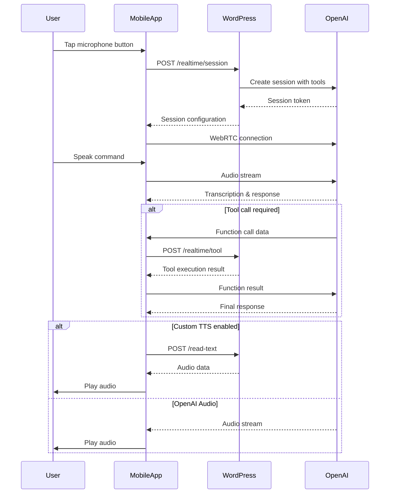

# Voice Assistant Mobile Web App

A mobile-optimized web application that provides hands-free voice interaction with the AI Commander WordPress plugin. Designed specifically for smartphones and tablets, this web app allows users to manage their WordPress sites using natural voice commands through any tools configured in the AI Commander plugin.

## Overview

The Voice Assistant Mobile Web App is a companion application to the AI Commander WordPress plugin, specifically designed for mobile devices. It enables users to interact with their WordPress-powered systems through voice commands, making it ideal for hands-free operation in environments where typing is impractical.

The app can do everything the AI Commander plugin can do; explore the [plugin documentation](../README.md) for more details.

## Features

### Core Features

- **🎙️ Real-time Voice Interaction**: Powered by OpenAI's Realtime API for natural, conversational voice commands
- **📱 Mobile-Optimized Interface**: Designed specifically for smartphones and tablets with touch-friendly controls
- **🔐 Secure Authentication**: Uses WordPress application passwords for secure API access
- **🔊 Custom Text-to-Speech**: Optionally use custom TTS model instead of OpenAI Realtime audio which often has issues with audio quality
- **💬 Visual Chat Interface**: Shows conversation history with message bubbles
- **⚡ Real-time Status Updates**: Visual feedback for connection, recording, processing, and speaking states
- **🎯 Push-to-Talk Mode**: Optional press-and-hold functionality for precise control over voice input

### Voice Assistant Capabilities

The voice assistant can execute any tools configured in AI Commander. The app comes with a set of built-in tools, but plugin developers can add any custom tools they want using the [`ToolRegistry`](../includes/ToolRegistry.php) class.

### Technical Features

- **🔗 WebRTC Integration**: Real-time audio streaming with OpenAI
- **🛠️ Tool Call Processing**: Seamless execution of WordPress actions via voice commands
- **🎵 Audio Interruption**: When using a custom TTS model, users can interrupt AI responses by tapping the microphone
- **📶 Connection Management**: Automatic session handling and reconnection
- **🔇 Smart Audio Management**: Microphone muting during TTS playback to prevent feedback
- **🎚️ Dual Input Modes**: Automatic Voice Activity Detection (VAD) with optional Push-to-Talk override

## Architecture

### High-Level Architecture

```
[Mobile Web App] ←→ [WordPress + AI Commander] ←→ [OpenAI Realtime API]
                           ↕
                    [WordPress Database]
                           ↕
                    [ToolRegistry + Custom Tools]
```

The mobile web app acts as a client interface that:
1. Authenticates with WordPress using application passwords
2. Creates sessions with OpenAI Realtime API via WordPress backend
3. Establishes WebRTC connections for real-time audio communication
4. Processes tool calls through WordPress REST API endpoints
5. Provides fallback TTS synthesis when needed

### Component Architecture

#### Frontend Components

- **Configuration Screen** (`configScreen`): Handles WordPress site connection setup
- **Main Application** (`mainApp`): Primary voice interface with chat and controls
- **Chat Container** (`chatContainer`): Message display and conversation history
- **Control Panel** (`controlPanel`): Voice recording button and status display
- **Settings Management**: Configuration changes and logout functionality

#### Audio Processing Pipeline

1. **Audio Capture**: Browser MediaDevices API captures microphone input
2. **WebRTC Streaming**: Real-time audio sent to OpenAI via WebRTC
3. **Speech Recognition**: OpenAI transcribes speech to text
4. **Command Processing**: AI processes commands and executes tool calls
5. **Response Generation**: AI generates text and audio responses
6. **Audio Playback**: Either OpenAI audio or custom TTS playback

#### Push-to-Talk Mode

The app includes an optional Push-to-Talk (PTT) feature that can be enabled via a configuration constant in the code:

```javascript
const ENABLE_PRESS_TO_TALK = true; // Set to true to enable PTT mode
```

When PTT is enabled:
- **Default behavior**: Voice Activity Detection (VAD) remains active for hands-free operation
- **Press and hold**: Temporarily disables VAD and records only while the button is pressed
- **Release to send**: Audio is committed and processed when the button is released
- **Seamless interruption**: During custom TTS playback, pressing and holding immediately interrupts the AI and starts recording
- **Mixed mode operation**: Users can switch between hands-free (VAD) and push-to-talk within the same session

This hybrid approach provides flexibility for users who need precise control over when their voice is captured, while maintaining the convenience of hands-free operation when desired.

#### State Management

The app maintains a centralized state object (`appState`) containing:
- Connection credentials and tokens
- Session status and modalities
- Message history and current interactions
- Audio stream and WebRTC connection objects
- Tool call queue and execution state
- Push-to-talk state and interruption flags

## Technical Flow

### Session Initialization

1. **Configuration**: User enters WordPress site URL, username, and application password
2. **Authentication Test**: App validates credentials against WordPress REST API
3. **Credential Storage**: Valid credentials stored in localStorage for future sessions
4. **Session Creation**: When voice interaction starts, app requests session token from WordPress
5. **WebRTC Setup**: Establishes peer connection with OpenAI using session token

### Voice Interaction Flow (open with Mermaid)



### Tool Call Processing

1. **Function Detection**: OpenAI identifies when a tool call is needed based on ToolRegistry configuration
2. **Queue Management**: Tool calls are queued for sequential processing
3. **Execution**: Each tool call is sent to WordPress `/realtime/tool` endpoint
4. **Tool Resolution**: WordPress ToolRegistry resolves and executes the appropriate tool
5. **Result Handling**: Tool results are formatted and sent back to OpenAI
6. **Response Generation**: OpenAI uses tool results to generate final response

### Audio Management

#### Standard Audio Flow (OpenAI Realtime)
- Audio streams directly through WebRTC
- Real-time processing with immediate feedback
- Built-in echo cancellation and noise reduction

#### Custom TTS Flow (Fallback)
- Text responses sent to WordPress TTS endpoint
- Audio file generated server-side
- Microphone muted during playback to prevent feedback
- Playback can be interrupted by user interaction

## API Integration

### WordPress REST API Endpoints

The mobile app interacts with these AI Commander endpoints:

- **`POST /wp-json/ai-commander/v1/realtime/session`**: Create OpenAI session with registered tools
- **`POST /wp-json/ai-commander/v1/realtime/tool`**: Execute tool calls via ToolRegistry
- **`POST /wp-json/ai-commander/v1/read-text`**: Generate TTS audio
- **`GET /wp-json/wp/v2/users/me`**: Validate authentication

### Authentication

Uses WordPress Application Passwords with Basic Authentication:
```javascript
Authorization: Basic base64(username:app_password)
```

## Installation and Setup

### Prerequisites
1. WordPress site with AI Commander plugin installed and configured
2. Valid OpenAI API key configured in AI Commander settings
3. WordPress user account with appropriate permissions
4. Generated WordPress application password

### Deployment
1. Upload the mobile web app files to your web server
2. Access the app URL from a mobile device
3. Configure with your WordPress site credentials
4. Test voice functionality and tool execution

